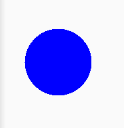

## 学习hencoder 仍物线大佬

## [Android 开发进阶: 自定义 View 1-1 绘制基础](https://hencoder.com/ui-1-1/)
    Canvas.drawXXX() 和 Paint 基础
    drawXXX() 系列方法和 Paint 的基础掌握了，就能够应付简单的绘制需求。它们主要包括：
    
    Canvas 类下的所有 draw- 打头的方法，例如 drawCircle() drawBitmap()。
    Paint 类的几个最常用的方法。具体是：
    Paint.setStyle(Style style) 设置绘制模式
    Paint.setColor(int color) 设置颜色
    Paint.setStrokeWidth(float width) 设置线条宽度
    Paint.setTextSize(float textSize) 设置文字大小
    Paint.setAntiAlias(boolean aa) 设置抗锯齿开关
### Circle 
```
    paint.setColor(Color.BLUE);
    canvas.drawCircle(100,100,50,paint);
```
